# 🧬 SARS-CoV-2 Genomic Signatures — Explainable Analysis

[](https://python.org)
[](LICENSE)
[]()
[](https://jupyter.org)

## Overview

This project extends the work of **Elsherbini et al. (BMC Bioinformatics, 2024)** by applying **explainable machine learning** to alignment-free genomic signature analysis of SARS-CoV-2 clades.

Instead of focusing solely on classification accuracy, this work investigates **why** certain k-mer features distinguish viral clades — providing biological interpretability through **SHAP analysis**, **CpG suppression quantification**, **statistical validation**, **Shannon entropy analysis**, and **evolutionary trajectory modeling**.

> 📌 Dataset provided as part of the **SOLE Competition (Feb 2025)** — Dr. Mohamed Mysara, Nile University, Egypt.

---

## 🔬 Key Findings

- **UMAP** reveals clear separation of later clades (GRA/Omicron, GK, GRY/Alpha)
- **XGBoost outperforms Random Forest** (82% vs 81%) and is 30% faster
- **SHAP analysis** reveals clade-specific k-mer signatures:
  - **GRA/Omicron** → AT-rich motifs (ATA, TAT) — distinct from all other clades
  - **GK & GRY/Alpha** → CpG-containing motifs (CGG, CCG)
- **CpG suppression** statistically confirmed (Kruskal-Wallis p=0.00) across all clades
- **G vs GV** are the only non-significantly different clades in CpG (Mann-Whitney p=0.86)
- **Clade G** shows lowest Shannon entropy (4.3715) — most genomic instability
- All later clades stabilize at entropy ~4.3744 — evolutionary plateau confirmed

---

## 📊 Results

### 1. PCA — Dimensionality Reduction

> After outlier removal (Z-score < 3), PCA reveals the non-linear nature of genomic signatures. Only 48% of variance is captured in 2 components.

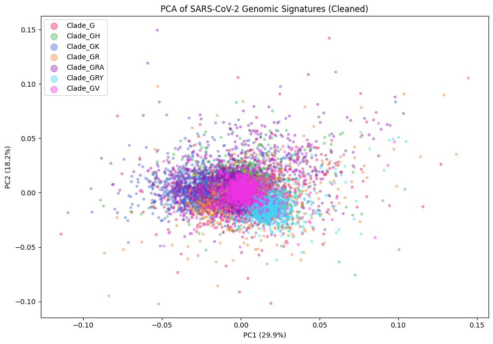

---

### 2. UMAP — Non-linear Visualization

> UMAP clearly separates the **later clades** (GRA/Omicron, GK, GRY/Alpha), while earlier clades (G, GH, GR, GV) overlap — reflecting evolutionary proximity.

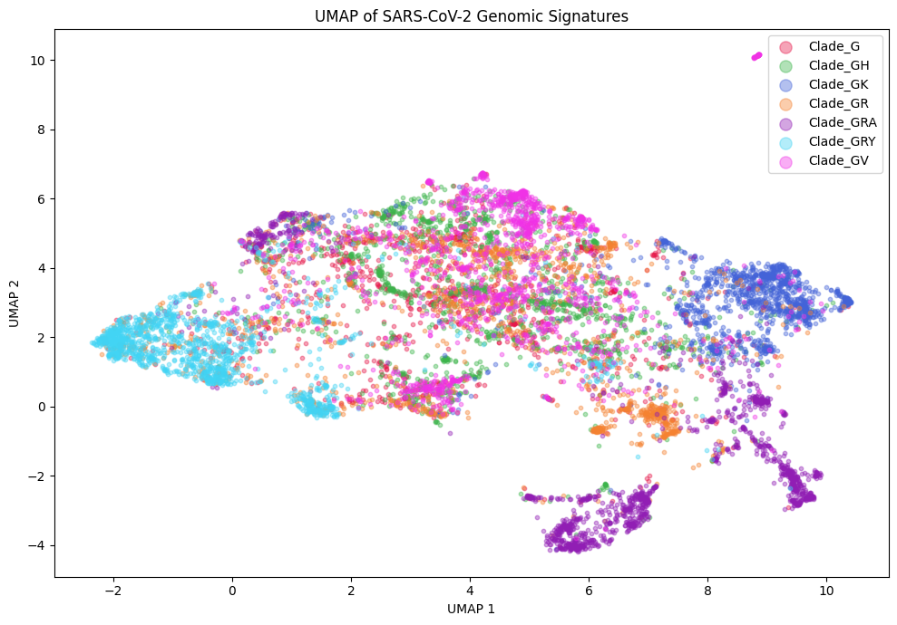

---

### 3. Random Forest vs XGBoost

> XGBoost consistently outperforms Random Forest across all clades while being ~30% faster.

| Model | Overall Accuracy | Training Time |
|-------|-----------------|---------------|
| Random Forest | 81% | 56.9s |
| **XGBoost** | **82%** | **39.2s** |

| Clade | RF F1 | XGB F1 |
|-------|-------|--------|
| GRA (Omicron) | 0.94 | **0.95** |
| GK | 0.89 | **0.92** |
| GRY (Alpha) | 0.88 | **0.89** |
| GV | 0.83 | **0.84** |
| GH | 0.72 | **0.74** |
| GR | 0.71 | **0.73** |
| G | 0.67 | **0.69** |

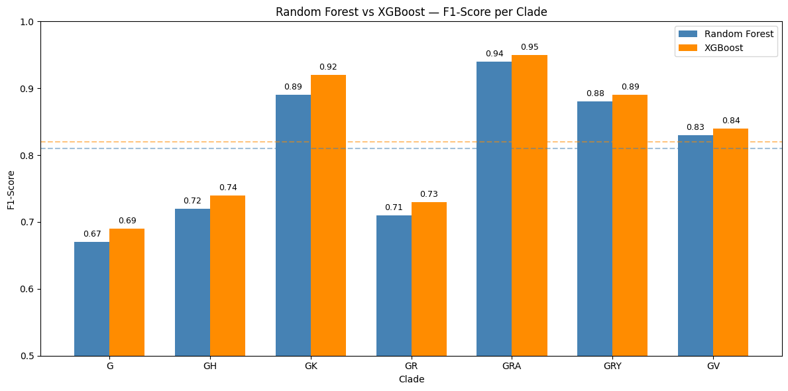

---

### 4. Confusion Matrix

> Main misclassifications occur between evolutionarily adjacent clades (G↔GH, GR↔GRY), confirming biological validity of the model.

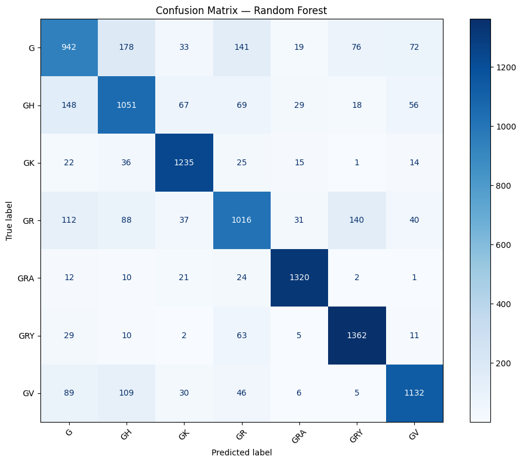

---

### 5. Feature Importance

> CpG-containing trinucleotides (CGG, CCG) and G/C-rich motifs dominate — confirming biological relevance of CpG dynamics.

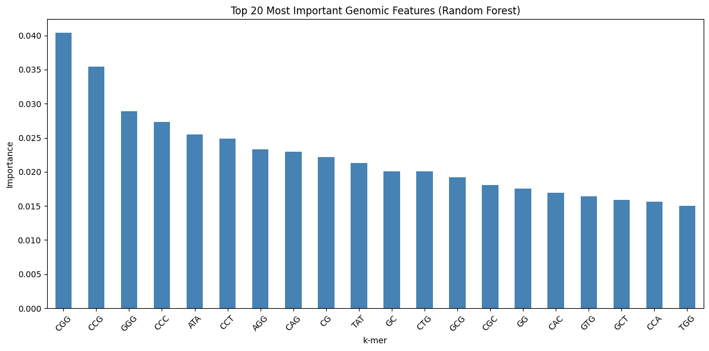

---

### 6. SHAP — Global Explainability

> SHAP values reveal per-clade contribution to each k-mer feature.

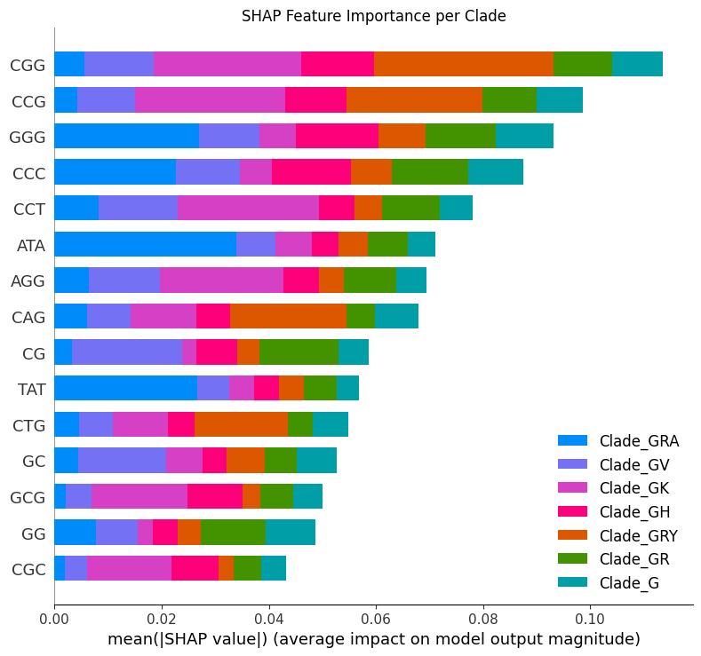

---

### 7. SHAP — Per Clade Signatures

> **GRA/Omicron** is driven by AT-rich motifs. **GK & GRY/Alpha** are driven by CpG motifs — fundamentally different evolutionary strategies.

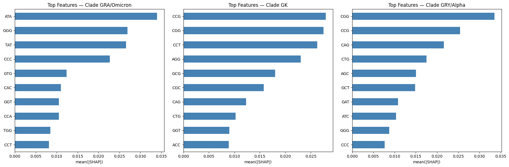

---

### 8. k-mer Heatmap

> Universal CpG suppression confirmed (CG — dark blue across all clades). Clade G shows distinct GCG/CGC enrichment not seen in later clades.

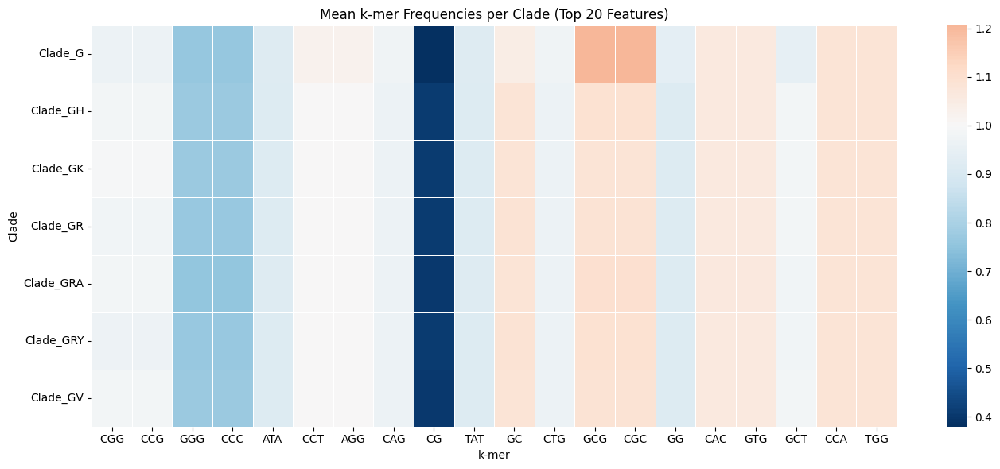

---

### 9. CpG Suppression Quantification

> All clades show ~60% CpG suppression. Clade G (earliest) shows strongest suppression (0.379).

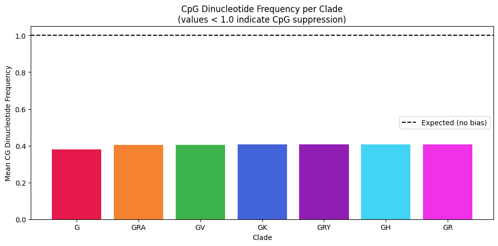

---

### 10. Statistical Validation

> Kruskal-Wallis test confirms highly significant differences in CpG frequencies across clades (H=89,384, p=0.00). Mann-Whitney post-hoc reveals G and GV are the only non-significantly different pair (p=0.86).

| Test | Result |
|------|--------|
| Kruskal-Wallis H | 89,384.44 |
| p-value | 0.00 (p < 0.001) |
| G vs GV | ❌ Not significant (p=0.86) |
| All other pairs | ✅ Significant |

---

### 11. Shannon Entropy Analysis

> Clade G shows the lowest entropy (4.3715 ± 0.0068) and highest variability — suggesting genomic instability in the earliest variant. All later clades stabilize at ~4.3744, confirming an evolutionary entropy plateau.

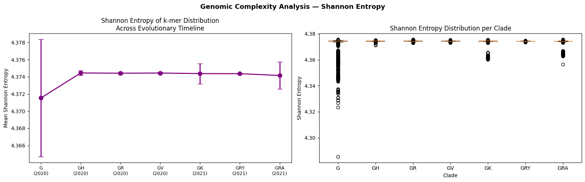

---

### 12. Evolutionary Trajectory

> CpG suppression is most pronounced in Clade G and stabilizes across later clades. GRA/Omicron breaks the GC-rich trend.

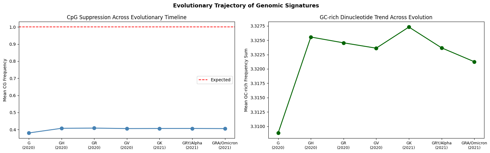

---

## 📦 Results Summary

| Analysis | Key Result |
|----------|-----------|
| PCA | 48% variance — non-linear structure |
| UMAP | GRA, GK, GRY clearly separated |
| XGBoost Accuracy | **82%** — best model |
| GRA F1-Score | **0.95** (XGBoost) |
| CpG Suppression | ~60% below expected |
| Kruskal-Wallis | H=89,384, p=0.00 ✅ |
| G vs GV CpG | Not significant (p=0.86) |
| Entropy — Clade G | 4.3715 ± 0.0068 — lowest & most variable |
| Entropy — Later clades | ~4.3744 — stable plateau |

---

## 🗂️ Repository Structure

```
SARS-CoV-2-Genomic-Signatures/
│
├── README.md
├── requirements.txt
├── LICENSE
│
├── notebooks/
│   ├── 01_EDA_and_PCA.ipynb
│   ├── 02_UMAP.ipynb
│   ├── 03_Random_Forest.ipynb
│   ├── 04_SHAP_Analysis.ipynb
│   ├── 05_CpG_Quantification.ipynb
│   └── 06_Evolutionary_Trajectory.ipynb
│
└── figures/
    ├── pca_clean.png
    ├── umap_plot.png
    ├── rf_vs_xgb.png
    ├── confusion_matrix.png
    ├── feature_importance.png
    ├── shap_summary.png
    ├── shap_per_clade.png
    ├── heatmap_clades.png
    ├── cpg_quantification.png
    ├── entropy_analysis.png
    └── evolutionary_trajectory.png
```

---

## 🔄 Analysis Pipeline

```
Raw k-mer frequencies (GenoSig — 560k genomes)
              ↓
     Outlier Removal (Z-score < 3)
              ↓
     PCA + UMAP Visualization
              ↓
     Random Forest + XGBoost Classification
              ↓
     Feature Importance + SHAP Analysis
              ↓
     CpG Suppression Quantification
              ↓
     Statistical Validation (Kruskal-Wallis + Mann-Whitney)
              ↓
     Shannon Entropy Analysis
              ↓
     Evolutionary Trajectory Modeling
```

---

## 📓 Notebooks

| # | Notebook | Description |
|---|----------|-------------|
| 01 | `EDA_and_PCA` | Exploratory analysis, outlier removal, PCA |
| 02 | `UMAP` | Non-linear visualization |
| 03 | `Random_Forest` | RF + XGBoost comparison |
| 04 | `SHAP_Analysis` | Global and per-clade explainability |
| 05 | `CpG_Quantification` | CpG analysis + statistical tests + entropy |
| 06 | `Evolutionary_Trajectory` | Temporal trends |

---

## 🧬 Dataset

- **560,000 SARS-CoV-2 whole genomes** from GISAID
- **80 features**: 16 Di-nucleotide + 64 Tri-nucleotide frequencies (normalized)
- **7 clades**: G, GH, GK, GR, GRA, GRY, GV
- Generated using [GenoSig](https://github.com/AhmedElsherbini/Code_for_Elsherbini_et_al_2023)

> ⚠️ Raw dataset not included. Contact dataset owner for access.

---

## 👥 Authors

- **Ibrahim Mustafa** — Bioinformatician & Field Application Specialist, MSc Bioinformatics, University of Sadat City
- **Hagar El-Azab** — Bioinformatician, BSc Graduate in Biotechnology, Faculty of Agriculture, Cairo University

---

## 📚 Reference

Elsherbini et al. (2024). *Utilizing genomic signatures to gain insights into the dynamics of SARS-CoV-2 through Machine and Deep Learning techniques.* **BMC Bioinformatics**, 25, 131.
https://doi.org/10.1186/s12859-024-05648-2

---

## 📄 License

MIT License
